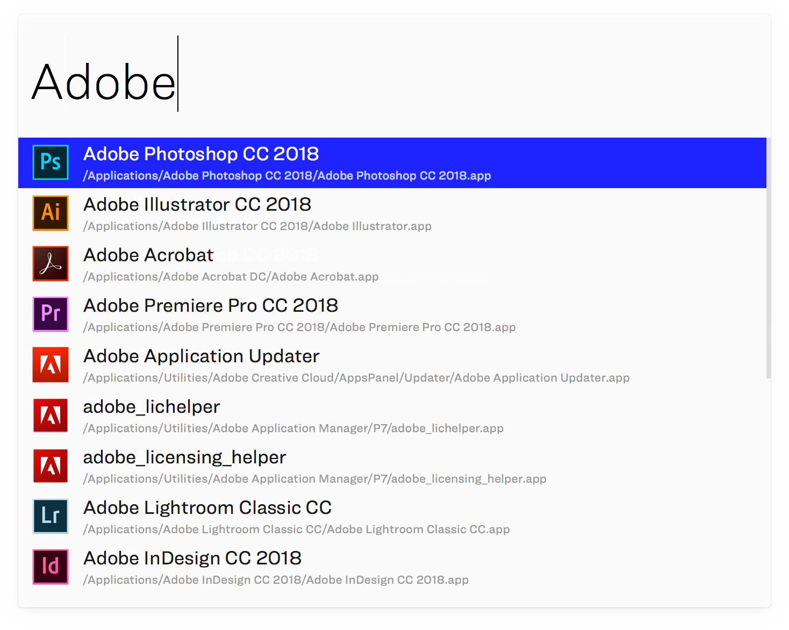

	

# Small Parade Alfred Theme
Minimal theme for the [Alfred application](https://www.alfredapp.com/). Based on their own Alfred macOS theme.

### Installation
1. Download the `Small Parade.alfredappearance` file.
1. Double-click the file and Alfred will open on the “Appearance” tab, asking if you’d like to import the theme.
1. Click “Import” and the theme will be imported and auto-selected.